# Plan de Ejecución — ControlHogar

## Resumen del Análisis Detallado

### Evaluación de Impacto de Cambios
- **Cambios orientados al usuario**: Sí — toda la aplicación es user-facing
- **Cambios estructurales**: Sí — nueva arquitectura completa (greenfield)
- **Cambios en modelo de datos**: Sí — diseño completo de esquemas PostgreSQL
- **Cambios de API**: Sí — diseño completo de APIs/RLS de Supabase
- **Impacto NFR**: Sí — seguridad, offline-first, tiempo real, cifrado

### Evaluación de Riesgo
- **Nivel de Riesgo**: Medio
- **Complejidad de Rollback**: Moderada (migraciones de base de datos reversibles)
- **Complejidad de Testing**: Moderada-Alta (offline sync, tiempo real, multi-plataforma)

---

## Visualización del Workflow

```mermaid
flowchart TD
    Start(["Solicitud del Usuario"])
    
    subgraph INCEPTION["INCEPTION PHASE"]
        WD["Workspace Detection<br/><b>COMPLETADO</b>"]
        RA["Requirements Analysis<br/><b>COMPLETADO</b>"]
        US["User Stories<br/><b>COMPLETADO</b>"]
        WP["Workflow Planning<br/><b>COMPLETADO</b>"]
        AD["Application Design<br/><b>EJECUTAR</b>"]
        UG["Units Generation<br/><b>EJECUTAR</b>"]
    end
    
    subgraph CONSTRUCTION["CONSTRUCTION PHASE"]
        FD["Functional Design<br/><b>EJECUTAR</b>"]
        NFRA["NFR Requirements<br/><b>EJECUTAR</b>"]
        NFRD["NFR Design<br/><b>EJECUTAR</b>"]
        ID["Infrastructure Design<br/><b>EJECUTAR</b>"]
        CG["Code Generation<br/><b>EJECUTAR</b>"]
        BT["Build and Test<br/><b>EJECUTAR</b>"]
    end
    
    Start --> WD
    WD --> RA
    RA --> US
    US --> WP
    WP --> AD
    AD --> UG
    UG --> FD
    FD --> NFRA
    NFRA --> NFRD
    NFRD --> ID
    ID --> CG
    CG --> BT
    BT --> End(["Completo"])
    
    style WD fill:#4CAF50,stroke:#1B5E20,stroke-width:3px,color:#fff
    style RA fill:#4CAF50,stroke:#1B5E20,stroke-width:3px,color:#fff
    style US fill:#4CAF50,stroke:#1B5E20,stroke-width:3px,color:#fff
    style WP fill:#4CAF50,stroke:#1B5E20,stroke-width:3px,color:#fff
    style AD fill:#FFA726,stroke:#E65100,stroke-width:3px,stroke-dasharray: 5 5,color:#000
    style UG fill:#FFA726,stroke:#E65100,stroke-width:3px,stroke-dasharray: 5 5,color:#000
    style FD fill:#FFA726,stroke:#E65100,stroke-width:3px,stroke-dasharray: 5 5,color:#000
    style NFRA fill:#FFA726,stroke:#E65100,stroke-width:3px,stroke-dasharray: 5 5,color:#000
    style NFRD fill:#FFA726,stroke:#E65100,stroke-width:3px,stroke-dasharray: 5 5,color:#000
    style ID fill:#FFA726,stroke:#E65100,stroke-width:3px,stroke-dasharray: 5 5,color:#000
    style CG fill:#4CAF50,stroke:#1B5E20,stroke-width:3px,color:#fff
    style BT fill:#4CAF50,stroke:#1B5E20,stroke-width:3px,color:#fff
    style INCEPTION fill:#BBDEFB,stroke:#1565C0,stroke-width:3px,color:#000
    style CONSTRUCTION fill:#C8E6C9,stroke:#2E7D32,stroke-width:3px,color:#000
    style Start fill:#CE93D8,stroke:#6A1B9A,stroke-width:3px,color:#000
    style End fill:#CE93D8,stroke:#6A1B9A,stroke-width:3px,color:#000
    linkStyle default stroke:#333,stroke-width:2px
```

### Leyenda
- 🟢 Verde sólido: Etapas completadas o de ejecución obligatoria
- 🟠 Naranja punteado: Etapas condicionales que se EJECUTARÁN
- ⚪ Gris punteado: Etapas que se OMITEN

---

## Fases a Ejecutar

### 🔵 FASE INCEPTION
- [x] Workspace Detection (COMPLETADO)
- [x] Requirements Analysis (COMPLETADO)
- [x] User Stories (COMPLETADO)
- [x] Workflow Planning (COMPLETADO)
- [ ] **Application Design** — EJECUTAR
  - **Justificación**: Proyecto nuevo con múltiples módulos que requiere definición de componentes, servicios y dependencias entre ellos. Se necesita diseño de capa de servicios y estructura de componentes.
- [ ] **Units Generation** — EJECUTAR
  - **Justificación**: El sistema tiene 6 épicas con dependencias entre sí (Auth es base para todo, Offline es transversal). Se requiere descomponer en unidades de trabajo ordenadas con dependencias claras.

### 🟢 FASE CONSTRUCTION (por unidad)
- [ ] **Functional Design** — EJECUTAR
  - **Justificación**: Cada unidad tiene modelos de datos, reglas de negocio (balance de gastos, recurrencia de tareas, merge de conflictos) y lógica compleja que requiere diseño detallado.
- [ ] **NFR Requirements** — EJECUTAR
  - **Justificación**: Se requiere selección de tech stack detallado (versiones, librerías de sync offline, framework de notificaciones), RLS en Supabase, cifrado, PBT framework.
- [ ] **NFR Design** — EJECUTAR
  - **Justificación**: Patrones de resiliencia (offline-first sync), seguridad (RLS, RBAC, headers), y observabilidad necesitan diseño técnico explícito.
- [ ] **Infrastructure Design** — EJECUTAR
  - **Justificación**: Configuración de Supabase (tablas, RLS policies, realtime subscriptions, storage buckets, edge functions), CI/CD pipeline, hosting del frontend.
- [ ] **Code Generation** — EJECUTAR (SIEMPRE)
  - **Justificación**: Implementación de código para cada unidad de trabajo.
- [ ] **Build and Test** — EJECUTAR (SIEMPRE)
  - **Justificación**: Instrucciones de build, tests unitarios, integración y PBT.

### 🟡 FASE OPERATIONS
- [ ] Operations — PLACEHOLDER (futuro)

---

## Etapas Omitidas

### 🔵 FASE INCEPTION
- ~~Reverse Engineering~~ — OMITIDO
  - **Justificación**: Proyecto greenfield, no hay código existente que analizar.

---

## Criterios de Éxito
- **Objetivo principal**: App funcional multiplataforma (web + móvil) con los 4 módulos del MVP
- **Entregables clave**:
  - Código TypeScript con estructura de monorepo
  - Esquema de base de datos PostgreSQL/Supabase con RLS
  - App web (React) + App móvil (React Native/Capacitor)
  - Sync offline-first con resolución de conflictos
  - Pipeline CI/CD configurado (GitHub Actions)
  - Tests unitarios + PBT + integración
- **Quality Gates**:
  - Cumplimiento de extensiones Security, Resiliency y PBT
  - Criterios de aceptación BDD de user stories satisfechos
  - Modo offline funcional con sync correcta
  - WCAG 2.1 AA en interfaces

## Estimación de Duración
- **Total de etapas restantes**: 8 (2 Inception + 6 Construction)
- **Complejidad estimada**: Moderada-Alta
